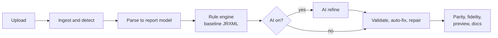

# Recast

Migrate legacy reports to JasperReports. Convert, validate, compare and document in one pass.

Recast is a local web app that converts **Crystal Reports, Power BI, IBM Cognos, SSRS and Talend** reports into **JasperReports 6.x JRXML**. Drop a file in and it parses the report, translates its formulas, generates the JRXML, validates it, scores how closely it matches the source, and writes documentation.

A rule engine always produces a valid baseline. An optional AI step (DeepSeek, then Gemini) refines it, and Recast falls back to the baseline if the AI output can't be repaired.

## Features

- **Five sources**, detected automatically from file content.
- **Rules first, AI second.** Works with no API key and no network.
- **Self-checking.** Built-in validator, auto-fixer, and up to two AI repair rounds.
- **Parity, fidelity and effort.** Structural and numeric checks against the source, a converted / approximated / not-converted list, and a manual vs AI-assisted hours estimate.
- **Studio** for one report, **Portfolio** for batch conversion.
- **Preview and PDF export** built in.
- **Local-first.** Credentials in a source file are redacted before anything is sent to an AI provider.

## How it works



## Supported sources

| Source | Input |
|---|---|
| Crystal Reports | XML from [RptToXml](https://github.com/ajryan/RptToXml). Raw `.rpt` is not readable. |
| Power BI | `.pbit` (recommended), PBIP zip, PBIR, `.pbix` (measure logic can't be read) |
| IBM Cognos | Report XML |
| SSRS | `.rdl`, `.rdlc` |
| Talend | `.item` |
| Any of the above | Inside a `.zip` |

## Quick start

Requires [Node.js](https://nodejs.org) 22.18 or newer. There is no install step.

1. **Extract the zip first.** Don't run anything from inside it.
2. Start the app: double-click `Start-Recast.cmd` (Windows) or `start-recast.command` (macOS), or run `./start-recast.sh` (Linux). Or run directly:

   ```bash
   node bin/server.mjs --serve-dist --open
   ```

3. Open **http://localhost:8787**. Try the files in `samples/` and `fixtures/`.

For Crystal `.rpt` files, run RptToXml on a machine with the Crystal runtime (see `tools/convert-rpt.cmd`) and drop the resulting XML in.

## Enabling AI

Recast reads API keys from environment variables and does **not** load `.env` by itself. Start it with Node's env-file flag:

```bash
cp .env.example .env     # add DEEPSEEK_API_KEY and/or GEMINI_API_KEY
node --env-file=.env bin/server.mjs --serve-dist --open
```

DeepSeek is tried first, then Gemini. If none is configured or all fail, the rule-based result is used. The AI receives the parsed report model, the baseline JRXML and the source definition. Recast never connects to your databases, so no data rows are sent.

## What you get

| Output | Notes |
|---|---|
| **JRXML** | JasperReports 6.x. Jaspersoft Studio 7 can open and upgrade it. |
| **Validation** | Static checks only; nothing is compiled. Open the result in Jaspersoft Studio before release. |
| **Parity and fidelity** | Structural score plus numeric checks on aggregates, and a list of what was not converted. |
| **Preview, PDF, docs** | Rendered by the app. Documentation is in Markdown. |

Previews and numeric checks run on 14 generated sample rows, so they verify structure and aggregate wiring, not your real numbers.

A report is marked **ready** only if the JRXML is valid, nothing is "not converted", parity is at least 85, and the numeric checks pass. Otherwise it is **needs-review**.

## Tech stack

| Layer | Technology |
|---|---|
| Frontend | React 19 single-page app, Vite-style build, plain CSS with light and dark themes |
| Backend | Node.js (ES modules), TypeScript bundled to `bin/server.mjs`, built-in `node:http` server |
| Parsing | `fast-xml-parser`, plus a built-in ZIP reader |
| Mapping | `server/jrxml/translate.ts` translates Crystal, SSRS, Cognos, DAX and Talend expressions into Java |
| Engine | `generate.ts` (JRXML), `validate.ts`, `pipeline.ts`, `ai.ts` |
| Storage | JSON files in `data/migrations/`, no database |

Parsers live in `server/parsers/` (one per platform) and all produce a common report model.

## HTTP API

| Method | Path | Purpose |
|---|---|---|
| `GET` | `/api/health` | Status and configured AI providers |
| `POST` | `/api/ingest?filename=NAME` | Upload raw file bytes (up to 200 MB) |
| `POST` | `/api/migrate` | Convert. Body: `{ filename, content, mode: "auto" \| "rules" }`. Streams progress as server-sent events |
| `GET` | `/api/migrations` | List conversions |
| `GET` | `/api/migrations/:id` | Full record. Add `/download` for JRXML or `/pdf` for PDF |
| `DELETE` | `/api/migrations/:id` | Delete a conversion |

## Configuration

| Variable | Default | Purpose |
|---|---|---|
| `DEEPSEEK_API_KEY`, `GEMINI_API_KEY` | none | Enable each AI provider |
| `RECAST_AI_ORDER` | `deepseek,gemini` | Provider order |
| `DEEPSEEK_MODEL`, `GEMINI_MODELS` | built-in | Override models |
| `PORT` | `8787` | Server port |
| `HOST` | localhost only | Set `0.0.0.0` to allow other machines |
| `RECAST_DATA_DIR` | `./data` | Where conversions are stored |

## Known limitations

- **Power BI `.pbix`** stores DAX measures in a compressed model. Export as `.pbit` for exact DAX and types.
- **DAX measures** are modelled as group or report-level variables, and complex ones are flagged for review.
- **SSRS:** only the first tablix and its dataset are mapped.
- **Subreports** are referenced, not converted. Gauges, maps and sparklines become placeholders.
- **Cognos date functions** and week-based `DateDiff` intervals are not translated.
- **Model-based sources** (Power BI, Cognos) have no SQL, so the generated query is a placeholder to replace.

## Security

Recast has **no authentication**. It listens on localhost by default; only set `HOST=0.0.0.0` on a trusted network. Its only outbound calls are to the AI providers, and only when a key is set.

## Troubleshooting

| Symptom | Fix |
|---|---|
| `Cannot find module …\bin\server.mjs` | Started from inside the zip. Extract it first. |
| `node is not recognized` | Install Node.js. |
| Port already in use | Recast is already running, or set a different `PORT`. |
| AI shows "not configured" | Start with `--env-file=.env` (see above). |

